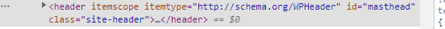
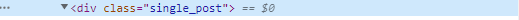
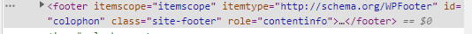
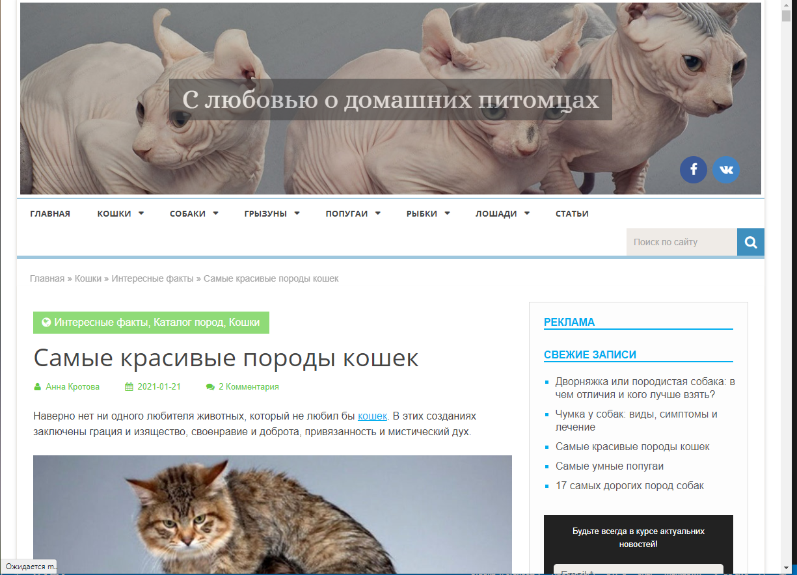
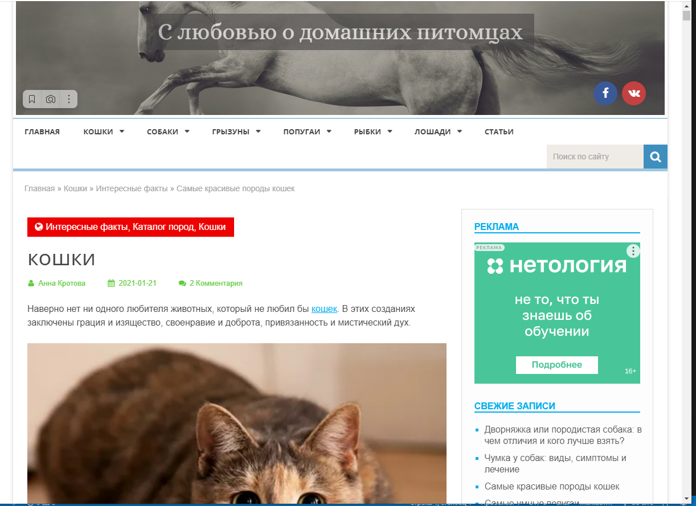
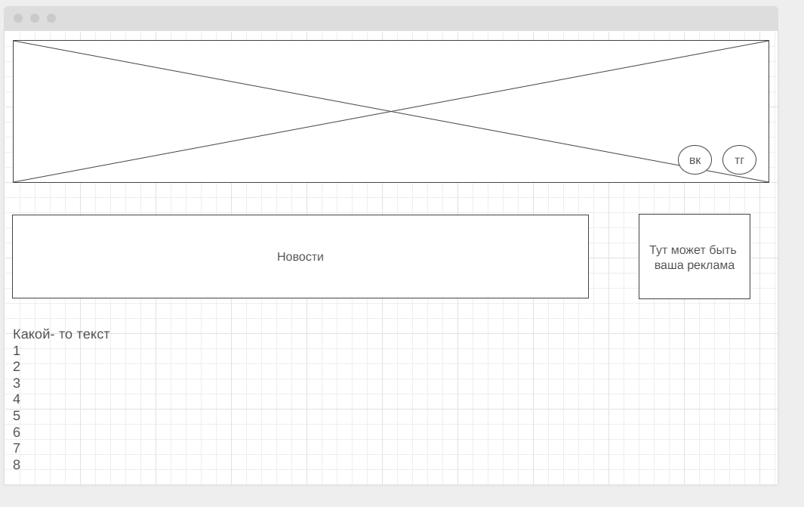

# Урок 1. Веб-технологии: вчера, сегодня, завтра

Задача: на основе сайта https://pet7.ru/koshki/interesnye-fakty-koshki/samye-krasivye-porody-koshek/

Определите, на каком протоколе работает сайт.
Проанализируйте структуру страницы сайта.
Внесите не менее 3 изменения на страницу с помощью инструмента разработчика и представьте скриншоты было/стало.
Создайте прототип низкой детализации (дополнительное задание, если на семинаре дошли до задания №8).

## Решение

1. Сайт работает на протоколе https
2. Тело' сайта - это всё, что есть на страницы, включая главный контент.
## Хедер сайта:

Внутри 'Тела' лежит контент, который состоит из заголовкой статьи, самого текса, картиной и вложенных ссылок. 
Также есть боковое меню - некое содержание, состоящее из ссылок на другие материалы, тех поддержку, инструметны для разработчиков, инструменты для печати или экспорта, статьи на других языках.
Далее мы видим указание партнёров.
## Тело сайта:

В самом низу - информация о копирайтах, конфидециальности, куки и прочих важных вещах.

## Футтер сайта:

4. Изменения на сайте 
## До:

## После:

## Задание 8:

